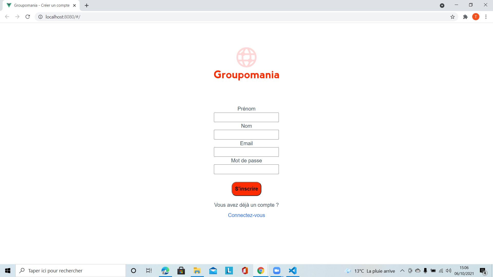

# Projet 7 : Créer un réseau social interne d'entreprise : Groupomania.

# Objectif du projet : 

    - Administrer la base de données avec MySQL
    - Créer son API avec Node.js et son framework Express
    - Créer et implémenter l'interface client avec Vue.js

# Fonctionnalités proposées V1 : 

    - Création d'un compte utilisateur : 

        

